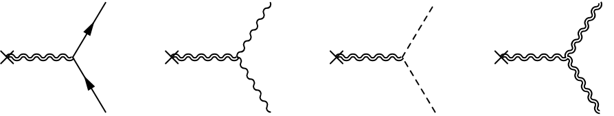

# Quantum radiation power from a classical Newtonian circular binary

This repository contains Mathematica routines for computing the leading-order quantum radiation power from a classical Newtonian circular binary into selected massless final states.

The implemented power calculations cover real minimally coupled scalar pairs, massless Dirac fermion pairs, photon pairs, the standard single-graviton classical radiation channel, and the IR-divergent bulk three-graviton contribution to two-graviton emission. The scalar, fermion, and photon pair-production power contributions are computed using spin-2 and spin-0 projections of the conserved classical source. The considered two-graviton power contribution comes from the Einstein-Hilbert cubic vertex, whose soft limit is controlled by the soft theorem (the corresponding soft divergence cancels against virtual soft-graviton corrections in an inclusive rate).

Open `QuantumRadiationBinary.nb`.  The notebook only loads `QuantumRadiationBinary.wl` and evaluates the result functions.

## Parameters

$$
\eta_{\mu\nu}=\mathrm{diag}(1,-1,-1,-1),\qquad
G=\hbar=c=1,\qquad M_{\rm pl}^{-2}=8\pi .
$$

$$
M=m_1+m_2,\qquad
\mu=\frac{m_1m_2}{M},\qquad
a=\text{orbital separation},\qquad
\Omega=\frac{2\pi}{T}=\text{orbital frequency}.
$$

For pair-production power calculations,

$$
x=\frac{\omega_1}{\Omega},\qquad
\omega_2=(2-x)\Omega,\qquad
q^\mu=k_1^\mu+k_2^\mu .
$$

The IR cutoff for the bulk three-graviton contribution is $\omega_{\min}$.

## Circular-binary EMT

At leading **Newtonian quadrupole** order, the Fourier component of the binary source at frequency $2\Omega$ is represented by

$$
T^{\mu\nu}(q)=\mathcal A e^\mu e^\nu,\qquad
\mathcal A=\mu a^2\Omega^2,
$$

$$
e^\mu=\left(\frac{\boldsymbol\epsilon\cdot\mathbf q}{q^0},\boldsymbol\epsilon\right),
\qquad
\boldsymbol\epsilon=\frac{1}{\sqrt2}(1,i,0),
\qquad
q_\mu T^{\mu\nu}=0 .
$$

The spatial block is

$$
T^{ij}=\frac{\mathcal A}{2}
\begin{pmatrix}
1&i&0\\
i&-1&0\\
0&0&0
\end{pmatrix}.
$$

## Propagator and amplitudes

In de Donder gauge,

$$
P_{\mu\nu,\rho\sigma}
=\frac12\left(
\eta_{\mu\rho}\eta_{\nu\sigma}
+\eta_{\mu\sigma}\eta_{\nu\rho}
-\eta_{\mu\nu}\eta_{\rho\sigma}
\right).
$$

The off-shell graviton sourced by the binary gives the factor

$$
\mathcal S^{\mu\nu}(q)=
2\pi i\frac{T^{\rho\sigma}(q){P^{\mu\nu}}_{\rho\sigma}}{q^2}.
$$

For one real **massless** scalar,

$$
\tau_\phi^{\mu\nu}
=k_1^\mu k_2^\nu+k_2^\mu k_1^\nu
-\eta^{\mu\nu}(k_1 \cdot k_2),
\qquad
\mathcal M_\phi=\mathcal S^{\mu\nu}\tau^\phi_{\mu\nu}.
$$

For one **massless** Dirac field,

$$
\Gamma_\psi^{\mu\nu}
=\frac14\left[
\gamma^\mu(k_1-k_2)^\nu+\gamma^\nu(k_1-k_2)^\mu
\right],
\qquad
\mathcal M_\psi=\mathcal S^{\mu\nu}\bar u(k_1)\Gamma^\psi_{\mu\nu}v(k_2).
$$

For one photon field,

$$
F_i^{\mu\nu}=k_i^\mu\epsilon_i^\nu-\epsilon_i^\mu k_i^\nu,
$$

$$
\tau_\gamma^{\mu\nu}
=-F_1{}^\mu{}_\alpha F_2^{\nu\alpha}
-F_2{}^\mu{}_\alpha F_1^{\nu\alpha}
+\frac12\eta^{\mu\nu}F_1^{\alpha\beta}F_{2,\alpha\beta},
\qquad
\mathcal M_\gamma=\mathcal S^{\mu\nu}\tau^\gamma_{\mu\nu}.
$$

For the standard single-graviton classical radiation amplitude,

$$
i\mathcal M_h=-\frac{i}{M_{\rm pl}}T^{\mu\nu}(k)\epsilon^*_{\mu\nu}(k).
$$

For each on-shell external graviton with momentum $p^\mu=(\omega,\mathbf p)$, the polarization sum is

$$
\sum_\lambda
\epsilon_{ab}(p,\lambda)\epsilon_{cd}^*(p,\lambda)
=\frac12\left(
\hat\eta_{ac}\hat\eta_{bd}
+\hat\eta_{ad}\hat\eta_{bc}
-\hat\eta_{ab}\hat\eta_{cd}
\right),
$$

where

$$
\hat\eta_{ab}
=\eta_{ab}
-\frac{p_a\bar p_b+p_b\bar p_a}{p\cdot\bar p},
\qquad
\bar p^\mu=(\omega,-\mathbf p).
$$

For the IR-divergent bulk three-graviton contribution to two-graviton emission,

$$
\mathcal M_{hh}^{\rm bulk}
=\mathcal S^{ab}(q)
V_{ab,cd,ef}(-q,k_1,k_2)
\epsilon_1^{*cd}\epsilon_2^{*ef}.
$$

Here $V_{ab,cd,ef}$ is the three-graviton vertex.

## Radiation Power

For two massless final particles,

$$
P_X=\frac{1/S}{64\pi^5}\Omega^4
\int_0^2 dx x(2-x)
\int d\Omega_1 d\Omega_2
\sum_{\lambda_1,\lambda_2}|\mathcal M_X|^2,
$$

with \(S=2\) for identical real scalar, photon and graviton pairs, and \(S=1\) for a Dirac fermion-antifermion pair. The factorized pair calculation uses

$$
P_X=C_X\mu^2a^4\Omega^8,\qquad
C_X=\frac{16}{\pi}\left(c_{2,X}I_2+c_{0,X}I_0\right),
$$

$$
I_2=\frac{2144\pi}{315},\qquad
I_0=\frac{16\pi}{315}.
$$

The projection coefficients are

$$
(c_{2,\phi},c_{0,\phi})=
\left(\frac{1}{480\pi},\frac{1}{48\pi}\right),
\qquad
(c_{2,\psi},c_{0,\psi})=
\left(\frac{1}{80\pi},0\right),
$$

$$
(c_{2,\gamma},c_{0,\gamma})=
\left(\frac{1}{40\pi},0\right).
$$

For the standard single-graviton classical radiation channel,

$$
\frac{dP_h}{du}\propto 1+6u^2+u^4,\qquad
\int_{-1}^{1}(1+6u^2+u^4)du=\frac{32}{5}.
$$

This reproduces Eddington's 1922 correction of Einstein's 1918 quadrupole result: $P_h=\frac{32}{5}\mu^2a^4\Omega^6$.

For the IR-divergent bulk three-graviton contribution to two-graviton emission,

$$
I_{hh}(x)=\frac{\pi}{75}
\left[2108-836(x-1)^2+1124(x-1)^4+148(x-1)^6+16(x-1)^8\right],
$$

with

$$
\frac{dP_{hh}^{\rm bulk}}{dx}=\frac{I_{hh}(x)}{64\pi^4x(2-x)}\mu^2a^4\Omega^8.
$$

## Results

$$
P_\phi=
\frac{128}{525\pi}\mu^2a^4\Omega^8 \overset{!}=\frac{12}{67}P_\psi.
$$

$$
P_\psi=
\frac{2144}{1575\pi}\mu^2a^4\Omega^8 .
$$

$$
P_\gamma=
\frac{4288}{1575\pi}\mu^2a^4\Omega^8 \overset{!}= 2P_\psi.
$$

$$
P_{hh}^{\rm bulk}=
\left[
-\frac{3007}{7875\pi^3}
\textcolor{red}{+\frac{8}{15\pi^3}
\ln\left(\frac{2\Omega-\omega_{\min}}{\omega_{\min}}\right)}
\right]\mu^2a^4\Omega^8 .
$$

For two-graviton emission, only the IR-divergent bulk three-graviton contribution is included in the amplitude, which is certainly not the complete gauge-invariant two-graviton amplitude. A complete result requires the remaining source/contact contributions to the two-graviton amplitude at the same order, which remain to be worked out...
